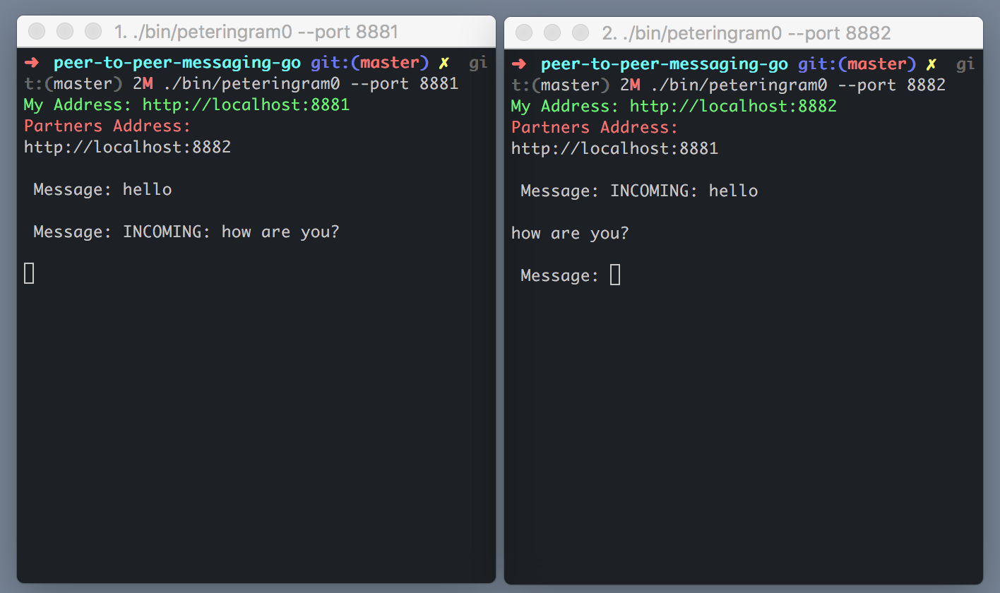

# Peer To Peer Messaging

Small peer to peer messaging application built to help me learn Golang.



## To Develop
````javascript
$ go run ./src/peteringram0/main.go --port 1234
````

## To Build
````javascript
$ export GOPATH=$HOME/code/peer-to-peer-messaging-go // Change to code path
$ bash ./build.sh
````

## To Run
````javascript
$ ./bin/peteringram0 --port 8881
````

### ToDo
* add DEP for package managment